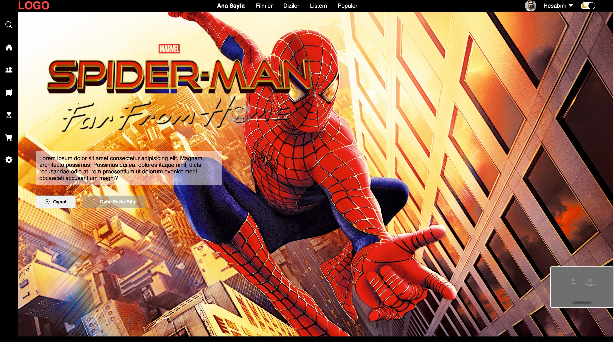

<h1> netflixBasic </h1>

Just basic clone of Netflix webpage , dark and lights modes are avaliable and added slidings between films codding by JS 

<h4> HTLM CSS and JS used to code this project </h4>

<h2>Screenshots</h2>

